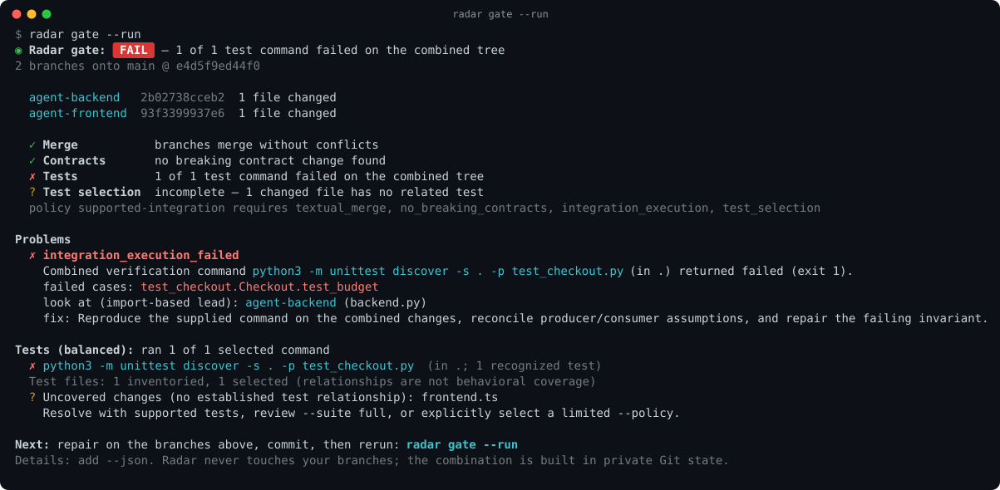

<p align="center"></p>

# Radar

**Two agents. Two green branches. One broken merge. Radar catches it before you merge.**

You run coding agents in parallel, each in its own worktree (cmux, Orca, Claude
Code, Codex, or plain `git worktree`). Each branch passes its own tests. Merged
together, they break. Radar combines the branches in private Git state, checks
the combination, runs selected tests when authorized, and provides repair leads.

It is a local CLI. It needs no API key, sends no telemetry, and never touches
your branches.

<p align="center"></p>

<details>
<summary>The same report as plain text</summary>

```console
$ radar gate --run
Radar gate: FAIL — 1 of 1 test command failed on the combined tree
2 branches onto main @ e4d5f9ed44f0

  agent-backend   2b02738cceb2  1 file changed
  agent-frontend  93f3399937e6  1 file changed

  ✓ Merge           branches merge without conflicts
  ✓ Contracts       no breaking contract change found
  ✗ Tests           1 of 1 test command failed on the combined tree
  ? Test selection  incomplete — 1 changed file has no related test
  policy supported-integration requires textual_merge, no_breaking_contracts, integration_execution, test_selection

Problems
  ✗ integration_execution_failed
    Combined verification command python3 -m unittest discover -s . -p test_checkout.py (in .) returned failed (exit 1).
    failed cases: test_checkout.Checkout.test_budget
    look at (import-based lead): agent-backend (backend.py)
    fix: Reproduce the supplied command on the combined changes, reconcile producer/consumer assumptions, and repair the failing invariant.

Tests (balanced): ran 1 of 1 selected command
  ✗ python3 -m unittest discover -s . -p test_checkout.py  (in .; 1 recognized test)
  Test files: 1 inventoried, 1 selected (relationships are not behavioral coverage)
  ? Uncovered changes (no established test relationship): frontend.ts
    Resolve with supported tests, review --suite full, or explicitly select a limited --policy.

Next: repair on the branches above, commit, then rerun: radar gate --run
Details: add --json. Radar never touches your branches; the combination is built in private Git state.
```

</details>

## Install

Linux (amd64, arm64) and macOS (Apple Silicon, Intel):

```sh
curl -fsSL https://raw.githubusercontent.com/Jake-Network/radar/v0.1.0/scripts/install-release.sh | bash -s -- --version v0.1.0
```

This installs a checksum-verified binary to `~/.local/bin` (`--dir` changes it).
Binaries need no Go or C compiler; Git is required, and `radar gate --run` uses
your repository's own test runners. Then:

```sh
radar doctor
radar setup --agent both --dry-run
```

Windows binaries are not published for 0.1.0: Windows Git defaults such as
`core.autocrlf` are not handled yet. On other systems, build from source with Go 1.23+ and a native C compiler (for Tree-sitter):

```sh
go install github.com/Jake-Network/radar/cmd/radar@v0.1.0
```

Release details and runtime limits: [RELEASING](docs/RELEASING.md).

## Use

From the main checkout, after your agents have committed on their branches:

```sh
radar gate          # combine every worktree branch; conflicts, contract breaks, tests to run
radar gate --run    # also run those tests on the combined tree
```

Run bare `radar` in a terminal for a menu that lists the branches beyond the
base, lets you pick which to combine, and dispatches the same commands (it
prints each one). Tests run only after you confirm. When stdin or stdout is not
a terminal, bare `radar` prints help as before.

On a terminal the report is colored (green pass, red fail, yellow for anything
unknown, incomplete or not run) and `radar gate` shows live progress on stderr;
every mark (✓ ✗ ? !) and word stays in the text, so nothing depends on color.
Pipes, files, CI logs, `--json` and the MCP server get plain output. Use
`--color auto|always|never`; `NO_COLOR` turns color off and `FORCE_COLOR` turns
it on for pipes. `--json` is never styled.

The default execution gate blocks when changed files lack an established test
relationship, inventory is incomplete, or required execution evidence is missing.
It lists discovered/selected tests, actual commands and recognized results.
Static relationships do not prove behavioral coverage. Review `--suite full`
for changes involving runtime file reads or dynamic imports; it runs supported
inventoried suites, with remaining inventory gaps still blocking.

You don't need setup or configuration
files. `radar gate` picks the base (`origin/HEAD`'s branch, `main`, `master` or
`trunk`) and every worktree branch that has commits beyond it. To choose
branches yourself, name them: `radar gate feature/api feature/web --base
develop`.

Only committed changes enter the candidate. Dirty worktrees are reported with
excluded staged, unstaged and nonignored untracked paths. Commit intended changes
and rerun. Detached worktree commits must be named explicitly.

Try the core failure scenario in an isolated temporary repository:

```sh
# From a source checkout, with Go, a C compiler, Git and Python 3:
go build -o /tmp/radar ./cmd/radar
bash scripts/smoke.sh /tmp/radar
```

The demo executes only the checked-in fixture: each full-inventory branch run
passes and the combined test fails. Nothing is merged into your checkout.

| Exit | Meaning |
| --- | --- |
| `0` | Named requirements passed; static mode has no runtime proof |
| `1` | A check failed (conflict, breaking contract, failing tests) or required evidence is missing |
| `2` | Radar could not run (bad ref, unreadable configuration, environment error) |

## Several repositories

When agents change a frontend and a backend, or any group of repositories,
register them once as a workspace. `radar gate` in any of them, or in any of
their worktrees, then checks all of them:

```sh
radar workspace add ../payments   # this repository + payments; paths only, no network
radar gate                         # every worktree branch of every workspace repository
radar gate orders:agent/api payments:agent/client   # only these; other repos take part at their base
radar gate --again --run           # same selection on the latest commits, with tests
```

Each repository is combined and checked on its own, in its own private Git
state. Declare a link to check producer schema changes against fields expected
by a consumer in another repository:

```sh
radar workspace connect orders:openapi.json#/components/schemas/Order payments \
  --fields total,status --direction response --source src/order.ts
```

This writes `.radar/workspace.json` in the home repository and
`.radar/consumes.json` in the consumer. Commit both files as the command directs.
The gate reads the team declaration from the home repository's base commit and
checks base/candidate combinations; the candidate+candidate cell determines
the link verdict. `cross_repo.status: passed` is evidence for the declared,
supported static links, not runtime interoperability. Missing or unsupported
inputs remain unverified. Without a team file, the gate reports
`per-repo checks only · 0 cross-repo links checked` and may suggest links for
explicit review. `.radar/contracts.json` declares links within one repository;
workspace links cross repositories.

`--with PATH` adds a
repository for one run, and `radar workspace show` lists what `radar gate` would
check. The registry lives in your user configuration directory and run records
in your user cache, never in a repository. A repository outside any workspace
keeps the single-repository behavior above. Design and later stages:
[MULTI_REPO](docs/MULTI_REPO.md).

## What it checks

- **Merge:** Radar merges all branches in a private object database. Your
  repository, refs and working tree are never written.
- **Contracts:** it compares OpenAPI and JSON Schema producers with their
  consumers. Without configuration, it reports candidates it discovers as
  warnings. Bindings you declare in `.radar/contracts.json` turn
  incompatibilities into failures.
- **Dependency impact:** it builds an import graph for TypeScript/JavaScript
  (relative imports, tsconfig `paths`/`baseUrl`, workspace package names),
  Python, Go, Rust, Java and C/C++ (`#include`), then follows it from the
  changed files to their dependents.
- **Tests:** it selects the tests related to the combined change. With `--run`,
  it runs them on the combined tree with a time and command budget. Tests it
  skips are listed, never silently dropped.
- **Attribution:** for each finding, it names the branches whose changed files
  the finding points at. For failing tests, it follows the tests' static
  imports. Treat this as a lead for repair, not proof of blame.

## Agents and CI

**Agents.** `radar setup --agent claude` (or `codex`, or `both`) installs a
project skill and the MCP server. Agents then call `radar_gate` before they
propose a merge. Agents can't run the tests themselves, because `--run`
executes repository code; a person runs it.

**CI.** Name the branches and choose which evidence is required:

```sh
mkdir -p .radar && echo '{"version":1,"require":["textual_merge","no_breaking_contracts","integration_execution","test_selection"]}' \
  > .radar/integration-policy.json
radar gate --run --policy .radar/integration-policy.json feature/api feature/web
```

This matches the default execution requirements. A deliberately limited custom
policy can omit requirements; its pass applies only to the listed checks and
remaining coverage gaps stay visible.

With a policy, required evidence that is missing makes the gate fail with
`NOT VERIFIED` (blocked), rather than letting it pass.

For a deployable PR workflow, copy the [GitHub Actions integration](integrations/github-actions/README.md).
It builds a reviewed immutable Radar revision, keeps static inspection available
by default, and requires explicit consent for repository-code execution. Its job
summary and JSON artifact show the candidate, findings, selected tests and missing
evidence. Additional PR heads participate only when explicitly selected.

## What a PASS means

Radar reports evidence. It doesn't certify correctness.

- **PASS:** every named requirement passed within the reported scope. It does
  not mean comprehensive verification. Without `--run`, the gate says
  `PASS (static)`, because no tests ran.
- **Import-based analysis:** dependency analysis follows imports. It does not
  resolve compiler types, and it does not see runtime reads such as files,
  environment variables or network calls.
- **Not a sandbox:** `--run` executes your tests with your user's permissions.
  The tests run in a private copy of the combined source, but that copy is not
  an operating-system sandbox. Untracked dependency directories such as
  `node_modules` are not copied, so a runner that is missing is reported as
  not run rather than as passed.

The full guarantees and limits are in [CAPABILITIES](docs/CAPABILITIES.md),
[VERIFICATION_POLICY](docs/VERIFICATION_POLICY.md) and
[SECURITY](docs/SECURITY.md).

## Beyond the gate

Radar also has a plan-and-evidence toolkit, listed under `radar help --all`.
You can write plans grounded in the indexed code, approve them with a review
bound to their digest, record test evidence bound to a commit, query the import
graph, and lint explicit contracts. See the [usage reference](docs/USAGE.md).
You can also run the [demos](docs/DEMO.md).

## Development

```sh
go test ./...
go vet ./...
bash scripts/smoke.sh "$(go build -o /tmp/radar ./cmd/radar && echo /tmp/radar)"
make demo-all
```

Native release jobs target Linux and macOS (amd64 and arm64).
Tags prepare assets; publishing requires a separate manual request. See
[RELEASING](docs/RELEASING.md) and the [changelog](CHANGELOG.md).
Also see [contributing](CONTRIBUTING.md), [architecture](docs/ARCHITECTURE.md),
[benchmarks](docs/BENCHMARKS.md) and the [roadmap](docs/ROADMAP.md). MIT licensed.
